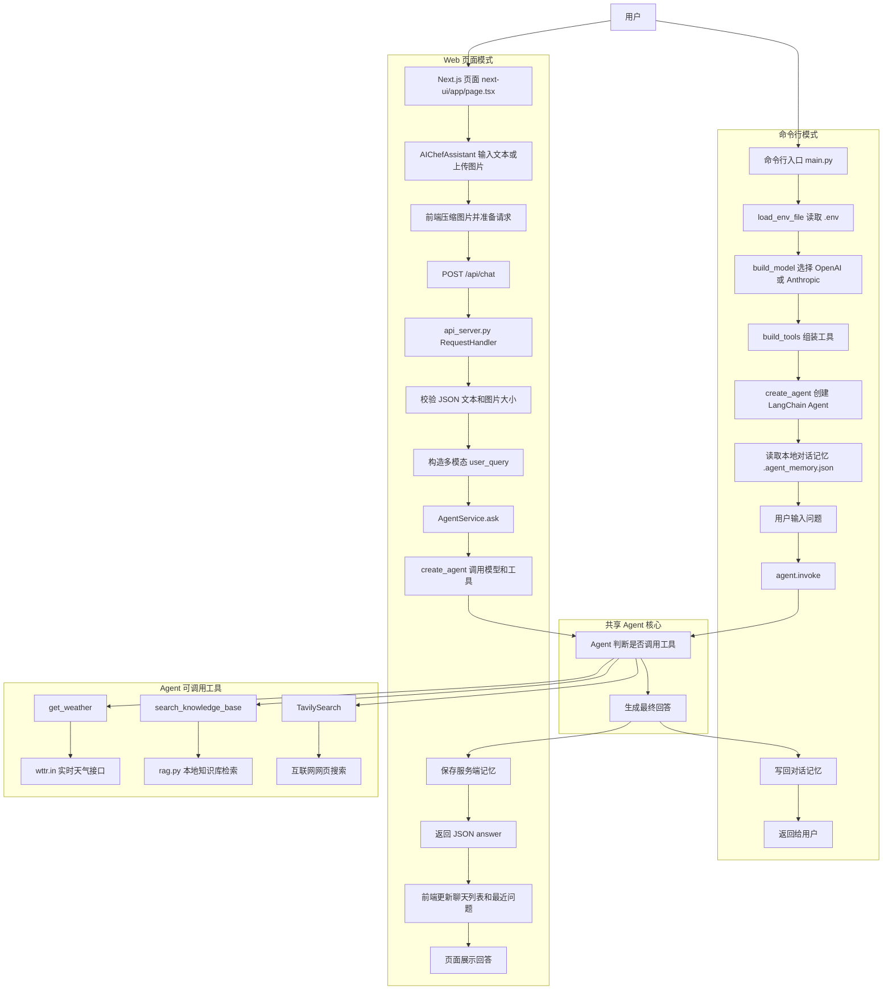
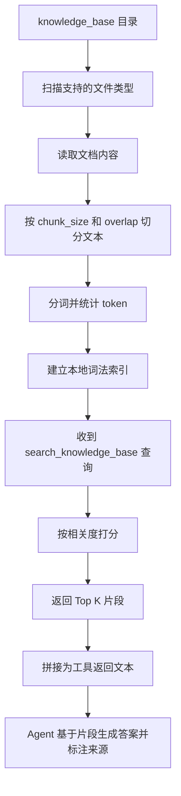

# 项目流程图

下面这份流程图基于当前仓库代码整理，覆盖：

- 命令行对话流程：`main.py`
- Web 页面提交流程：`next-ui` -> `api_server.py`
- Agent 内部工具分流：天气、知识库 RAG、Tavily 搜索

## 1. 总体流程图

## 2. 知识库 RAG 流程

## 3. 关键文件对应关系

- `main.py`：命令行入口、模型初始化、工具注册、记忆管理
- `api_server.py`：HTTP 服务、多模态请求封装、服务端记忆管理
- `rag.py`：本地知识库扫描、切分、索引、检索
- `next-ui/app/page.tsx`：前端状态管理、发请求、聊天记录和最近问题
- `next-ui/app/components/AIChefAssistant.tsx`：聊天界面、图片上传、消息渲染
